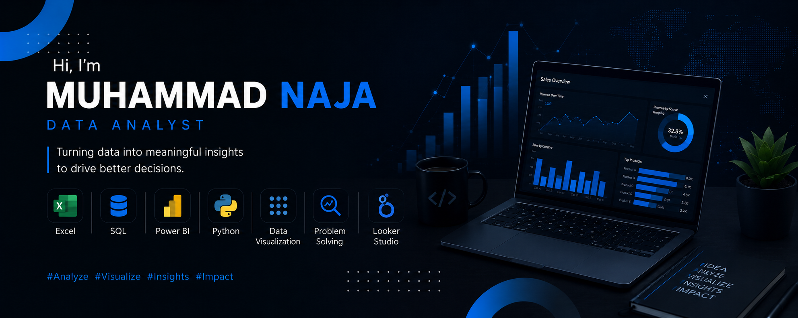

# Hi, I'm muhammadnaja

## Transformating data into actionable insights through analytics and visualization

<h1 align="left">Hi 👋, I'm Muhammad Naja</h1>
<h3 align="left">Aspiring Data Analyst</h3>

🔭 Building Data Analytics Projects

🌱 Learning Advanced SQL, Python, and Statistics

📊 Creating Interactive Dashboards with Power BI & Looker Studio

☁️ Exploring BigQuery and Cloud Analytics

📚 Preparing for a Master's Degree in Data Analytics

🎯 Turning Data into Actionable Insights
🔭 Currently building Data Analytics projects

🌱 Learning SQL, Python, Power BI, and Looker Studio

📊 Interested in Data Analytics, Business Intelligence, and Data Visualization

🎯 Goal: Become a professional Data Analyst

📚 Preparing for Master's degree in Data Science / Analytics

💡 Passionate about turning data into actionable insights

